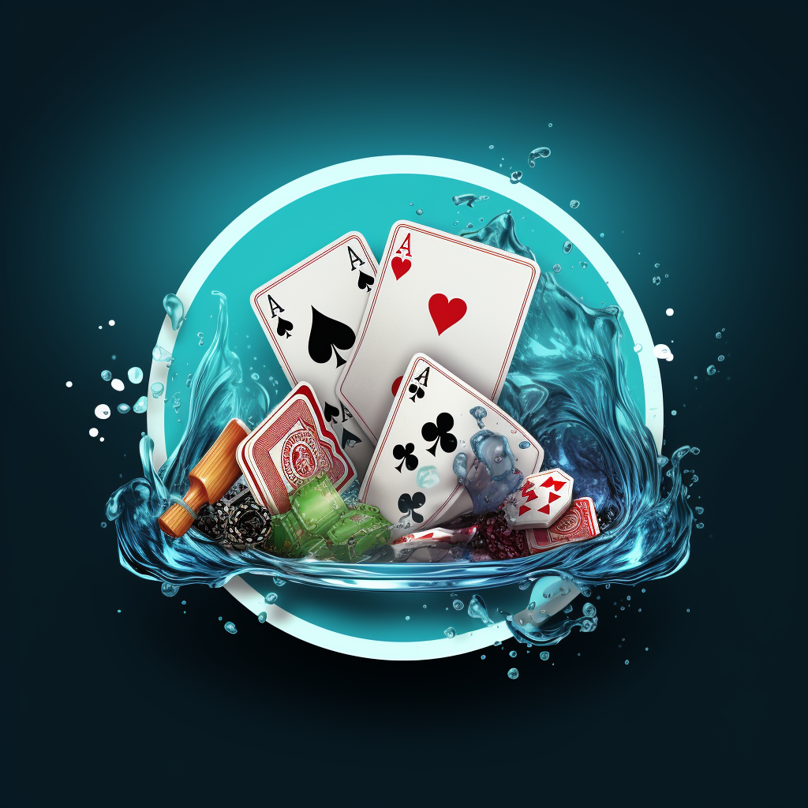
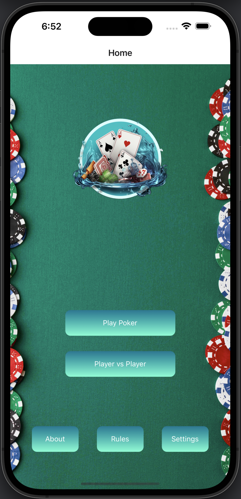

# Rinse & Raise Poker Arena

Table of Contents
- [Description](#description)
- [Author](#author)
- [Built With](#built-with)
- [Getting Started](#getting-started)
- [Project Overview & Demos](#project-overview--demos)

 ## Description

A mobile app designed for Texas Hold'em players seeking heads-up challenges.

It is inspired by the love story of Eric (Author) and Sophy who found a fun way to decide on daily chores using a poker game. 
This game is not only a tribute to the creative solution but also a handy tool for others finding themselves in similar situations.

## Author

- [**Eric Chang**](https://github.com/ESC8504)

## Built With
 
 
 
 
 
 
 
 
 

## Getting Started

1. **Clone the repo**

   `git clone https://github.com/ESC8504/RinseAndRaisePokerArena.git`

3. **Navigate to project directory**
   
   `cd your-project-name`

5. **Install necessary dependencies**
   
   `npm install`

6. **Update any example.config.js and example.env**

7. **Run the application**

   `npm run ios`

## Project Overview & Demos

- Play Poker Hold'em Heads Up with a friend.
- Share a phone functionality for offline gameplay.
- User-friendly interface with smooth gameplay.
- Decide on daily chores in a fun way.

  
   
  

